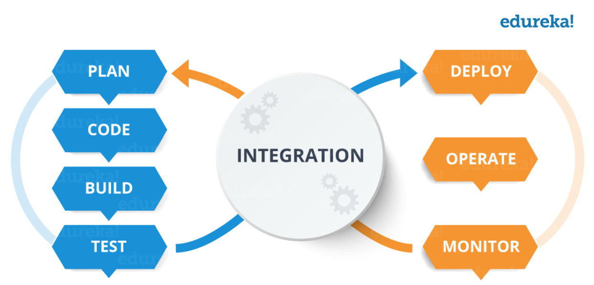

# DevOps-CI-CD-Pipeline-Learning

Temelde modern DevOps alani gelisim gosterirken, CI/CD konseptini anlamak bu asamada cok faydali olacaktir. Bu yazi dizisinde Pipeline komponentini sifirdan kurmayi ogrenecegiz.

CI/CD (Continuous Integration/Continuous Deployment) Pipeline uygulamasi modern DevOps ortaminin omurgasigir. Deployment ve operasyon ekibi arasinda olusan boslugu otomasyon, test ve deploy ederek kapatan bir kopru gorevi gorur. CI/CD nedir ve nasil calisir, onu gorecegiz.

Oncelikle DevOps konseptini anlamak adina asagidaki semayi inceleyelim.  

