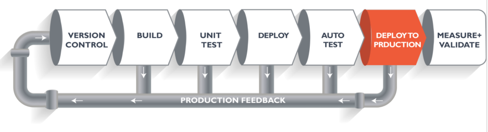
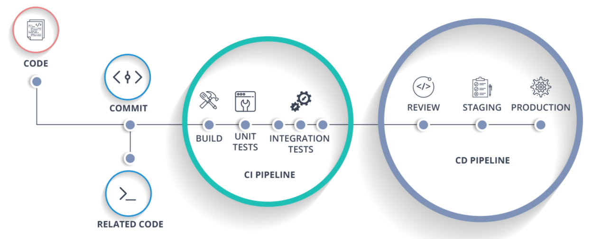

# DevOps-CI-CD-Pipeline-Learning

Temelde modern DevOps alani gelisim gosterirken, CI/CD konseptini anlamak bu asamada cok faydali olacaktir. Bu yazi dizisinde Pipeline komponentini sifirdan kurmayi ogrenecegiz.

CI/CD (Continuous Integration/Continuous Deployment) Pipeline uygulamasi modern DevOps ortaminin omurgasigir. Deployment ve operasyon ekibi arasinda olusan boslugu otomasyon, test ve deploy ederek kapatan bir kopru gorevi gorur. CI/CD nedir ve nasil calisir, onu gorecegiz.

Oncelikle DevOps konseptini anlamak adina asagidaki semayi inceleyelim.  


DevOps yazilim gelistirme yaklasimi olup, surekli entegrasyon ve izlemeye dayali bir gelistirme surecidir. Bugunlerde hemen hemen her orta ve buyuk olcekli sirketlerin adaptasyon sagladigi, yuksek kaliteli yazilimi zamandan tasarruf ederek tatmin edici sonuc elde etmek amaciyla kullandigi bir komponent olmustur. Asagida DevOps'un yasam, bir baska deyisle proje dongusunu inceleyelim.


**CI**, *Continuous Integration* yani surekli entegrasyon manasina gelip, **CD** ise *Continuous Delivery/Development* yani teslimat/dagitim manasina gelir. CI/CD sureci yazilim gelistirme proje dongusune cok benzerdir.

Simdi ise nasil calistigini inceleyelim.


Yukarida gorulen Pipeline, boru hatti, yazilim surecinin mantiksal ispatinda, guzargahinda nasil ilerledigini, hangi asamalardan gectigini gosteriyor bize. Yani gorunen bu surec, urunun olusmadan veyahut musteriye teslim edilmedenki hali.

Simdi bir CI/CD Pipeline senaryosu dusunelim. Gercek zamanli web server'da web uygulamasi gelistirdigimizi hayal edelim. Coklu yazilim gelisitiricilerinin calistigi, uzerinde ugrastigi bir proje bu. Takimdaki yazilim gelistiricilerin kodlarini *version control system* yani **git** ve **svn** gibi platformalara yukleyecekler. Pipeline sisteminde, yazilan kodlarin konuldugu asama olan **build phase** *olusum safhasina* gelmis olacak.


Varsayalim ki, bu Java kodu, son yurutmeye girmeden onde derlenmesi gerekiyor. version control safhasinda yeniden *build phase* kisminda islem gorecek, derlenmeden once. Yazilim havuzundan gelen (repository) bircok farkli kodlar derleme icin birlesecekler. Butun bu surec *build phase* safhasini tanimliyor.


*Build phase* asamasi bittikten sonra, **test phase** asmasina gelir. Bu asamada, bir cok farkli test uygulanir. Bunlardan biri ise ***unit test*** dedigimiz yazilimin parca parca test edildigi kisimdir.


Test asamasi tamamlandiktan sonra, **deploy phase** kismina gelinir ve burada ya deploy edilir ya da server uzerinde test edilir. Bu asamada kodu veyahut aplikasyonu, uygulamayi simule halde gorebiliriz.


Kod basariyla deploy edildikten sonra bir baska dogruluk/uygunluk testi yapilir. Eger ki, her sey yolunda giderse, o zaman uretim kismina havale edilir.



Bu arada, her bir adimda, eger hata tespit edilirse, yazilim gelistirme takimina hatanin duzeltilmesi icin bilgi verilir. Sonra, tekrardan version control system'ine yuklenir ve Pipeline'dan tekrardan gecer.


Bu proje dongusu urun veya kod onaylanincaya kadar devam eder. Bu son asama ise **measure/validate** safhasidir.

Bu kisa bilgi ile CI/CD Pipeline surecini ve nasil calistigini anlamaya calistik. Simdi ise Jenkins nedir ve nasil kullanilir onu anlamaya calisacagiz.

## The Ultimate CI Tool and Its Importance in the CI/CD Pipeline

Amacimiz, yazilim gelistirici departmanindan aldigimiz kodun urun asamasina gelene kadar olan zamanda bu sureci automate etmek. Yazilim gelistirme proje dongusunu DevOps/automate mod icinde Pipelineboru hattini otomatik hale getirecegiz.


**Jenkins** bizlere bir cok arac gerec ve arayuz saglayarak yazilim gelistirilmesinin automate etmedeki surecinde yardimci olacak.

Biliyoruz ki, yazilim gelistirme ekibinin kodlari teslim ettigi Git repository'suna sahibiz. Daha sonrasinda *Jenkins* bu asamada devreye girecek ve front-end arac gereci olarak tum isi ve gorevleri tanimlamamizda saglayici olacak. Amacimiz, Continuous Integration yani surekli entegrasyon olgusunun saglandigindan emin olmak.

Jenkins kodu Git'ten ceker ve kodlarin her bir daldan commit edildigi *commit phase*'e yonlendirir. Eger bu bir Java koduysa Jenkins'deki Maven'i kullaniriz, kodu derleriz ve deploy ederiz.

Daha sonra ise, *staging server*'a yonlendirir ve Docker'i kullanarak deploy ederiz. Bir kac unit testten sonra urun olarak deger kazanir.



***Docker*** server olusturabilecegimiz sanal bir ortam olarak dusunebiliriz. Cok kisa sure icerisinde server olusturabiliriz ve deploy edip islem hatalarini gozden gecirebiliriz.

***Nicin Docker kullaniyoruz?*** Cunku, cok kisa bir sure icerisinde tum cluster'i calistirabiliriz. imaj kayitlari tutabilir ve bunlari depolayabiliriz. Istegimiz herhangi bir vakitte ve her ortamda bunlari kullanabilir replicalarini yapabiliriz.


## Hands-On: Building a CI/CD Pipeline Using Docker and Jenkins

Step 1: Terminalimizi aciyoruz ve Jenkins ve Docker'lari baslatiyoruz.

```hyper
 launchctl start jenkins

 launchctl enable jenkins

 launchctl start docker
 ```

Step 2: Daha sonra ise belirtilen porta giriyoruz. Benim durumumda [http://localhost:8080/](http://localhost:8080/). Ardindan **New Item** butonuna tiklayalim.


Step 3: **freestyle** projesine tiklayalim the itemimize isim verelim. (Job1 diyorum ben)


Step 4: **Source Code Management**'i secip, **Git** repository'imizi yapistirdiktan sonra, **Apply** butonuna tikliyoruz.


Step 5: Daha sonra **Build** sekmesine gelip **Execute Shell**'i secelim.


Step 6: Simdi ise shell komutlarini saglamamiz gerekiyor.


Step 7: Ayni sureci tekrarlayip **Job2** adinda item olusturup shell komutlarini girmemiz gerekiyor.


Step 8: Ayni sureci tekrarlayip **Job3** adinda item olusturup shell komutlarini girmemiz gerekiyor.


Step 9: Job1, Job2 ve Job3 icin **Configure** yapacagiz. Ve **Post-build Actions** sekmesinden **Build other project**i sececegiz.


Step 10: **Build Pipeline View** isaretleyip isim verecegiz.


Step 11: **initial Job** kismina Job1 yazip okay diyelim.

Step 12: **Run** deyip CI/CD surecini calistiralim.


Step 13 : Olusturma basariyla gerceklestikten sonra, [localhost:8180/sample.text](localhost:8180/sample.text) acalim.


> [Learn How to Set Up a CI/CD Pipeline From Scratch](https://dzone.com/articles/learn-how-to-setup-a-cicd-pipeline-from-scratch)
